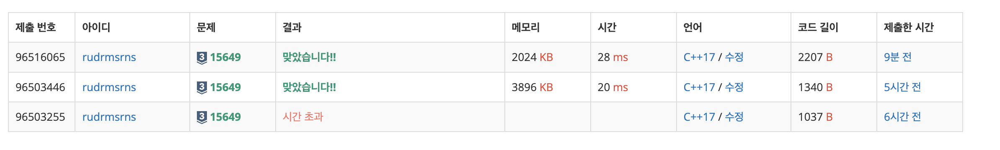
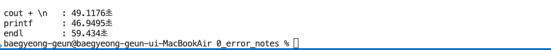

# C++ 출력 방식 비교

##  개요

8! (40320) 회의 연산을 요구하는 O(N!) 복잡도의 문제(N ≤ 8)를 해결하던 중, 정답 풀이에도 불구하고 **시간 초과**가 발생했습니다.

이 문제의 원인은 연산보다는 **느린 출력 처리**에 있다는 의심을 갖게 되었고,
`std::cout` 대신 `printf`를 사용해 출력 방식을 바꿨더니 **정상 통과**되는 현상을 확인했습니다.

---

##  출력 처리 방식

`std::cout`은 문자열을 출력할 때 **즉시 출력**하지 않고, 내부의 **출력 버퍼 (`std::streambuf`)에 임시 저장**합니다. 이 버퍼는 일정 조건에 도달하거나 명시적으로 `flush()`가 호출되면 실제 터미널로 전송됩니다.

###  flush와 출력버퍼를 메신저로 비유
- "안녕하세요"를 메신저로 보낼 때, "안", "녕", "하"... 를 개별 전송하지 않고,
- 입력창에 모두 입력한 뒤 **전송 버튼**을 눌러 한 번에 보내는 것과 같습니다.
- 이때:
  - **입력창 → 출력 버퍼**
  - **전송 버튼 → flush() 호출**

### `std::endl`의 동작
- `std::endl`은 단순히 줄바꿈(`\n`)을 출력하는 것 외에, **즉시 flush()를 호출**하여 버퍼의 내용을 터미널에 강제로 출력합니다.
- 이때 **시스템 콜**이 발생하며 커널과 사용자 모드 간 **context switch**가 일어나므로, 성능에 큰 영향을 줄 수 있습니다.

### 시스템 콜의 오버헤드
- 시스템 콜은 단순 함수 호출보다 **훨씬 무겁고 느립니다**.
- `std::endl`을 반복적으로 사용할 경우, **flush()가 과도하게 호출**되어 출력 속도가 현저히 느려질 수 있습니다.

---

##  시간 비교 테스트

###  테스트 조건
- 코드: `time_benchmark.cpp`
- 내용: "1\n" 문자열을 **50,000,000회 출력**
- 측정 방식: 프로그램 전체 실행 시간 측정

###  결과 요약

| 출력 방식 | 처리 시간 | 비고 |
|-----------|------------|------|
| `printf("1\n")` | 가장 빠름 : 46.94초| 내부 버퍼 사용 + flush 최소 |
| `std::cout << "1\n"` | 두 번째 : 49.11초 | `\n`은 자동 flush 아님 |
| `std::cout << "1" << std::endl` | 가장 느림 : 59.43초 | 매 출력마다 flush 발생 |

---

##  결론 

- **자주 출력하는 경우 `std::endl`은 지양**하고 `"\n"`을 사용.
- **출력 속도가 중요한 경우 `printf`가 유리**할 수 있습니다.
- `std::ios::sync_with_stdio(false);` + `std::cin.tie(nullptr);`로 입출력 최적화도 가능하지만, `scanf/printf`와 `cin/cout`을 **혼용하지 마세요**.
    - 이는 std::cout의 클래스가 자동으로 c++과 c의 표준입출력을 동기화화 하는것을 해제하여 방식으로 입출력의 순서가 뒤바뀔 수 있습니다. 

---

> 🔧 소스 코드 예제나 테스트 파일은 `/time_benchmark.cpp`에 위치합니다.

